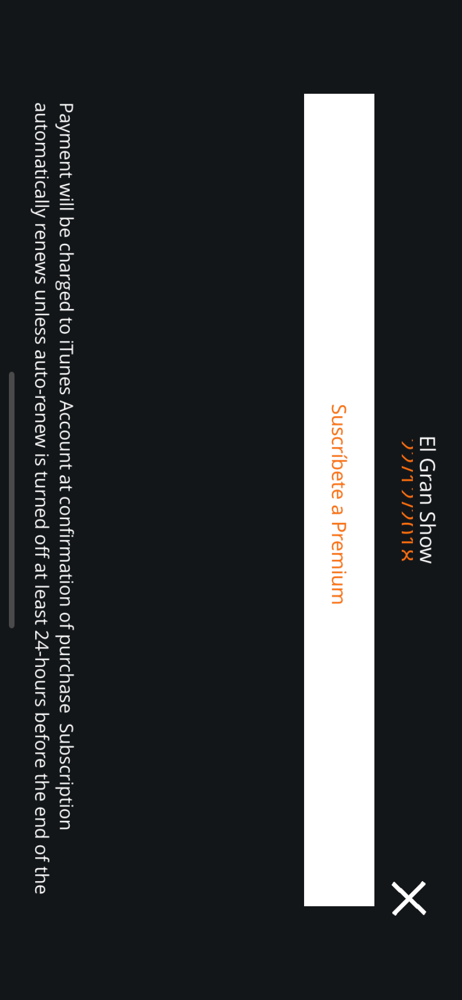
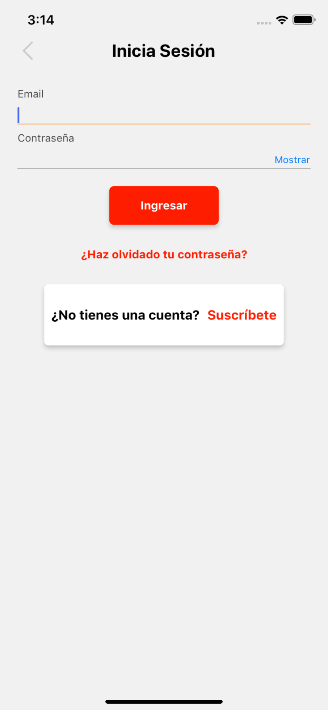
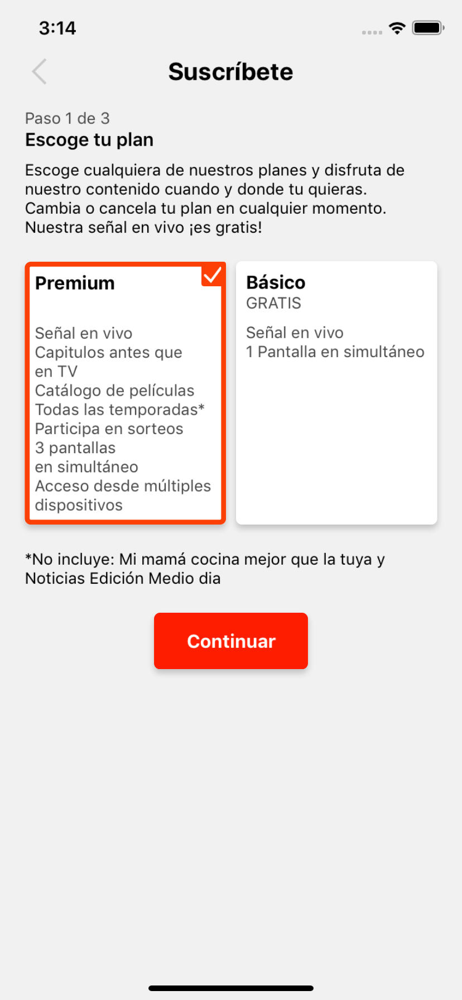
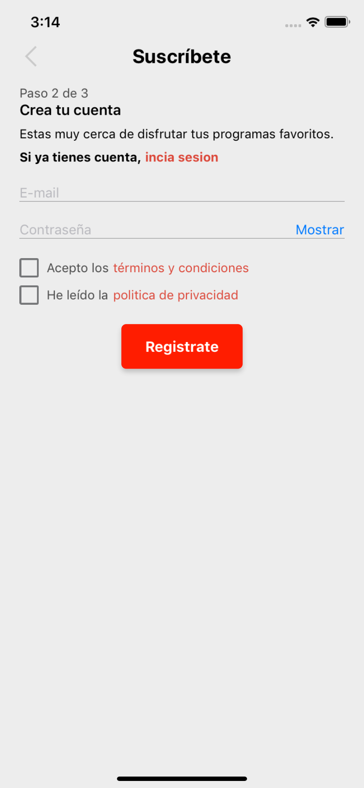
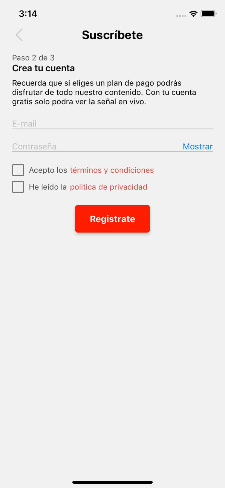

# AmericaTVGoAuthProvider for iOS

## Getting started

This plugin is used to allow the America TVGO app to make IAP (in app purchases) so that the user can watch exclusive content.

It has support for the following:

- Login
- Registration
- Password Recovery
- Package retrieval (the actual IAP products)
- Purchase processing

The IAP happens through 2 API: Apple's and AmericaTV's.

First we use AmericaTV's API to retrieve the products they want to sell. Then, we use Apple's API to retrieve the products on the developer side and see if there is a match between those products and the ones retrieved using AmericaTV's API.

Once the user has selected a product, we continue using Apple's API to make the actual purchase. When that completed successfully, we use AmericaTV's API to register the purchase on their end.

Everytime the plugin is launched we do a check to see if a token is still available. If not, that means the user has not made any purchase or that the purchase has expired.

## Configuration

The following fields can be configured:

- provider_key: should be set to americaTV by default

## Screenshots

## Submit an Issue

For submitting issues and bug reports, please use the following link:
https://github.com/applicaster/AmericaTVGoAuthProvider-iOS/issues/new

## Code of Conduct

Please make sure to follow our code of conduct:
https://developer-zapp.applicaster.com/Code-Of-Conduct.html
